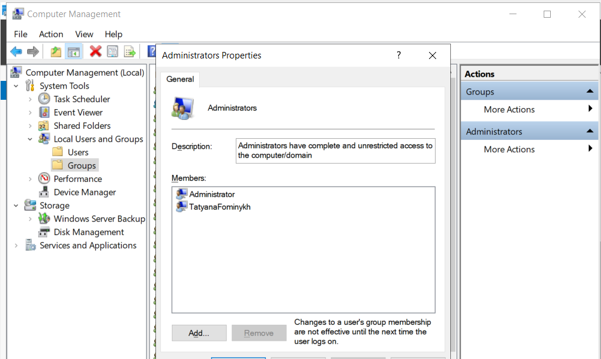
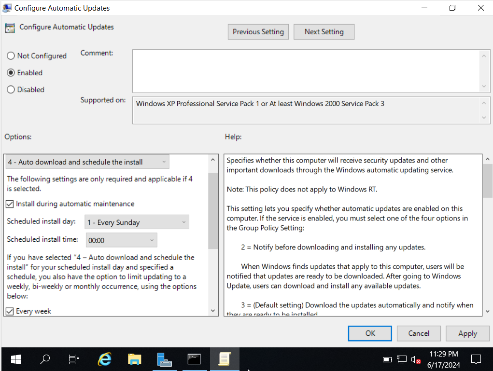
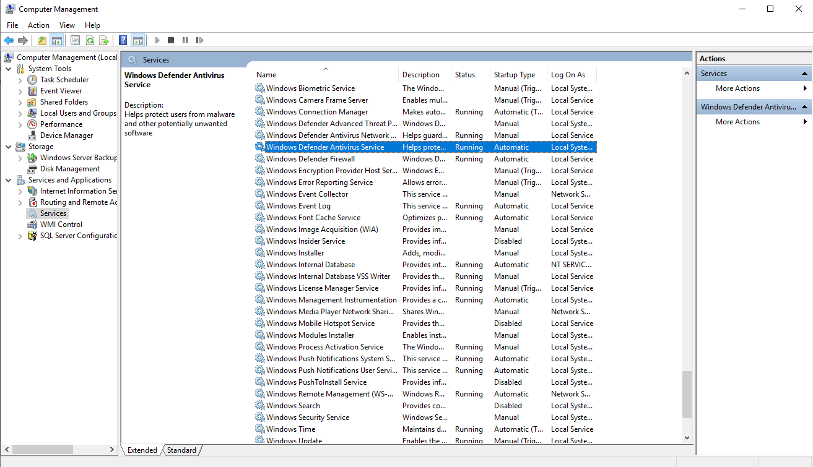
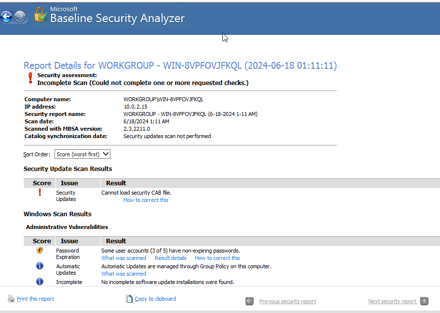
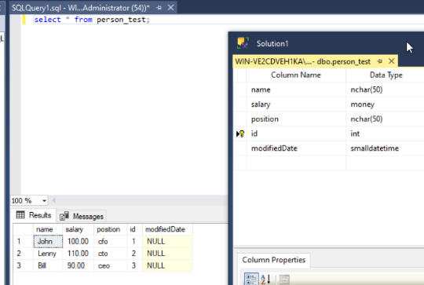

# ЗАДАНИЕ: 

Установите Windows Server 2019. Скачать ISO-образ можно по этой ссылке.
После установки создайте учётную запись с правами администратора. Укажите ваше имя и фамилию слитно латинскими буквами. Сделайте скриншот.

❗️ Внимание! Приложите скриншот с именем пользователя в окне «Управление компьютером → Пользователи → Локальные пользователи».

Настройте автообновление версий и патчей сервера. Сделайте скриншот окна обновлений.

Проверьте, активен ли встроенный антивирус и установлены ли все актуальные обновления (любым способом). Сделайте скриншот.

Установите MBSA и проверьте операционную систему на наличие уязвимостей. Получите файл отчета MBSA и сохраните его. Сам файл нужно будет приложить в отчёт по домашней работе. 

pdf file link: 

Установите SQL Server 2019.  Запустите программу по созданию записей в базе и подтвердите, что всё готово. Сделайте скриншот.
Опишите все ваши действия в одном отчёте о проделанной работе. К каждому шагу приложите скриншот и краткое описание. 
 
 

В форму приёма ответа приложите ссылку на текстовый отчёт о настроенной системе.
 

КРИТЕРИИ ПРОВЕРКИ:
Выполнены все действия, последовательность шагов не нарушена: 0–1 балл.
Скриншоты приложены там, где это нужно: 0–3 балла.
Все настроено правильно: 0–3 балла.
Приложен отчёт MBSA: 0–1 балла.
Максимальное кол-во баллов — 8.

